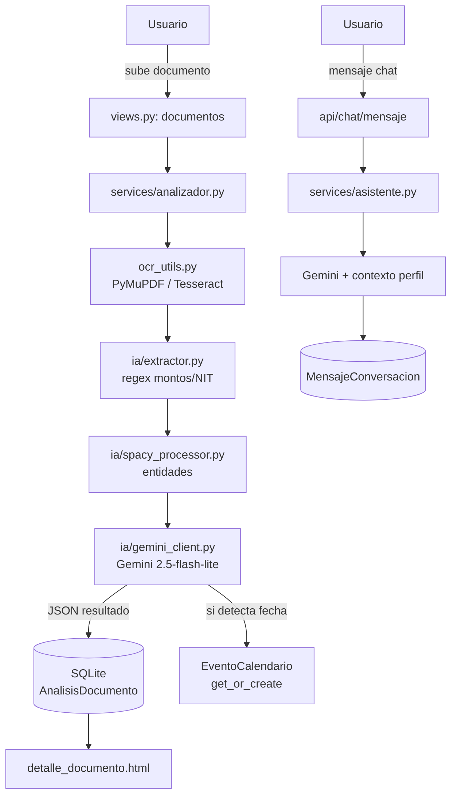

# Arquitectura Actual

**Proyecto:** TributIA

## 1. Usuario o actor principal

Contribuyente salvadoreño (persona natural: empleado, freelance, dueño de pequeña empresa) que necesita gestionar y entender sus obligaciones tributarias.

## 2. Interfaz o punto de entrada

Aplicación web renderizada del lado del servidor con templates Django (HTML/CSS/JS vanilla, sin frameworks JS). El usuario navega por `dashboard`, `documentos`, `centro-analisis`, `calendario`, `asistente-ia` y `recursos-fiscales`.

## 3. Backend actual

Monolito Django que maneja en el mismo proceso: autenticación, vistas, lógica de negocio y orquestación del pipeline de IA. No hay separación entre API y backend de aplicación — todo corre dentro de las mismas vistas de Django (`views.py`).

## 4. Componente de IA

Pipeline de 4 etapas ejecutado sincrónicamente dentro del request HTTP (`core/services/analizador.py`):

1. **OCR** (`core/ocr_utils.py`) — PyMuPDF para PDF con texto embebido, Tesseract (`pytesseract`) como fallback para escaneados/imágenes.
2. **Extracción por regex** (`core/ia/extractor.py`) — montos, NIT, subtotal/IVA/total.
3. **NLP con spaCy** (`core/ia/spacy_processor.py`, modelo `es_core_news_sm`) — entidades (empresa, cliente, fecha).
4. **Google Gemini** (`core/ia/gemini_client.py`, modelo `gemini-2.5-flash-lite`) — clasificación, corrección de entidades, resumen y recomendación en formato JSON.

El asistente conversacional (`core/services/asistente.py`) también usa Gemini, con contexto del perfil tributario y documentos del usuario.

## 5. Datos utilizados

- SQLite como base de datos relacional (modelos: `PerfilTributario`, `DocumentoTributario`, `AnalisisDocumento`, `EventoCalendario`, `ConversacionAsistente`, `MensajeConversacion`).
- Archivos subidos por el usuario almacenados localmente vía `MEDIA_ROOT`.
- Datos de referencia fiscal de El Salvador embebidos en código (`core/datos_el_salvador.py`: tasas ISR, IVA, ISSS, AFP).

## 6. Servicios externos

- **Google Gemini API** (análisis de documentos y chat).
- **Gmail SMTP** (envío de correos de recuperación de contraseña).

## 7. Flujo básico de información

## 8. Dependencias manuales o puntos frágiles

- El pipeline de análisis corre **síncrono dentro del request** → sin cola de tareas, riesgo de timeout con documentos grandes o Gemini lento.
- **Modelo de Gemini fijo** (`gemini-2.5-flash-lite`) por restricciones de billing de la API key actual; no hay fallback automático si la cuota se agota (error 429).
- **Tesseract** debe estar instalado manualmente en el sistema operativo — no se gestiona vía pip ni está containerizado.
- **Carga de spaCy y cliente Gemini en tiempo de import**, lo que acopla el arranque del servidor a la disponibilidad de esos recursos.
- Sin manejo de errores exhaustivo en cada etapa del pipeline (OCR, regex, spaCy, Gemini).
- Almacenamiento de archivos en disco local (`MEDIA_ROOT`), sin backup ni almacenamiento en la nube.
- Sin pruebas automatizadas que protejan el pipeline ante cambios.
