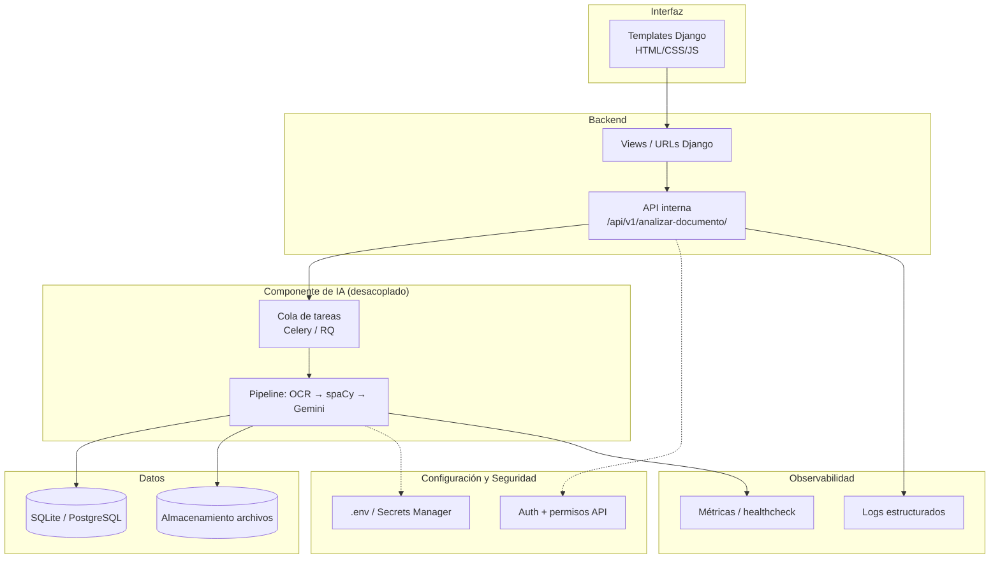

# Arquitectura Objetivo

**Proyecto:** TributIA
**Horizonte:** Semanas 2 a 6 del Módulo 4

## Visión general

El objetivo no es reescribir TributIA desde cero, sino evolucionar el monolito actual hacia una arquitectura con **capas separadas y desplegable**, manteniendo Django como base pero desacoplando la IA, agregando pruebas, contenedor, observabilidad y seguridad de forma incremental.

## 1. Separación entre interfaz, backend, IA, datos y configuración

- **Interfaz**: se mantienen los templates Django actuales; a mediano plazo evaluar exponer el dashboard también vía la API interna.
- **Backend**: las vistas dejan de invocar directamente `analizador.py`; en su lugar llaman a un endpoint interno versionado (`/api/v1/...`).
- **IA**: el pipeline (`analizador.py`, `gemini_client.py`, `spacy_processor.py`) se aísla como módulo independiente, ejecutado de forma asíncrona.
- **Datos**: modelos y acceso a BD permanecen en Django ORM; se evalúa migrar de SQLite a PostgreSQL para producción.
- **Configuración**: todas las claves y parámetros de entorno permanecen fuera del código (`.env` / gestor de secretos), sin hardcoding.

## 2. Posible API o endpoint inteligente — Semana 2

- Definir contrato de entrada/salida claro para `POST /api/v1/analizar-documento/`: entrada = archivo + tipo; salida = JSON con `es_documento_tributario`, `es_deducible`, entidades, montos, `resumen_ia`, `recomendacion_ia`, `confianza_clasificacion`.
- Mover la lógica de `analizador.py` para que sea invocable tanto desde la vista web como desde este endpoint, evitando duplicación.
- Documentar el contrato (ej. con un esquema JSON o Swagger básico).

## 3. Pruebas y automatización — Semana 3

- Suite de tests unitarios para: extracción regex, parsing de respuesta de Gemini, cálculo de `confianza_clasificacion`.
- Tests de integración para el flujo `subir documento → análisis → guardado en BD`, usando mocks para Gemini y Tesseract.
- Configurar CI (GitHub Actions) que corra `manage.py test` en cada push.

## 4. Contenedor o despliegue — Semana 4

- `Dockerfile` para la app Django, incluyendo instalación de Tesseract dentro de la imagen.
- `docker-compose.yml` con servicios: app, base de datos (PostgreSQL), y opcionalmente Redis para la cola de tareas.
- Variables de entorno inyectadas vía `.env` o secretos del proveedor de hosting.

## 5. Logs, métricas o monitoreo — Semana 5

- Logging estructurado (JSON) para cada etapa del pipeline de IA (tiempos de OCR, spaCy, Gemini; errores capturados).
- Endpoint de healthcheck (`/health/`) para verificar disponibilidad de Gemini, BD y Tesseract.
- Métrica básica de cuota de Gemini consumida por día, para anticipar el límite de 20 solicitudes/día si se usa `gemini-2.5-flash`.

## 6. Seguridad, documentación final y defensa — Semana 6

- Revisión de credenciales hardcodeadas remanentes y migración completa a variables de entorno / secretos.
- Validación de permisos por usuario en endpoints (que un usuario no pueda ver documentos de otro).
- Documentación final consolidada (README + docs/) y preparación de demo en vivo con manejo de riesgos (ver `riesgos-tecnicos.md`).
